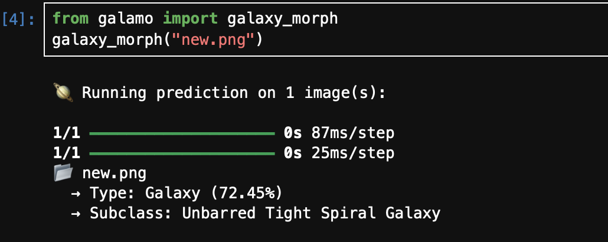
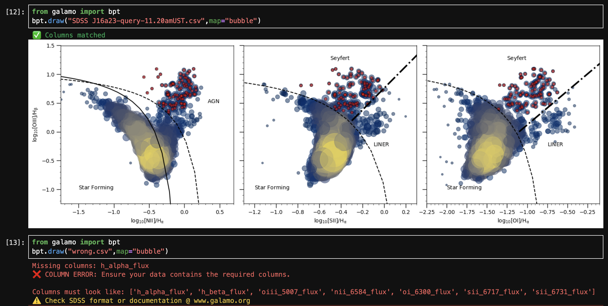
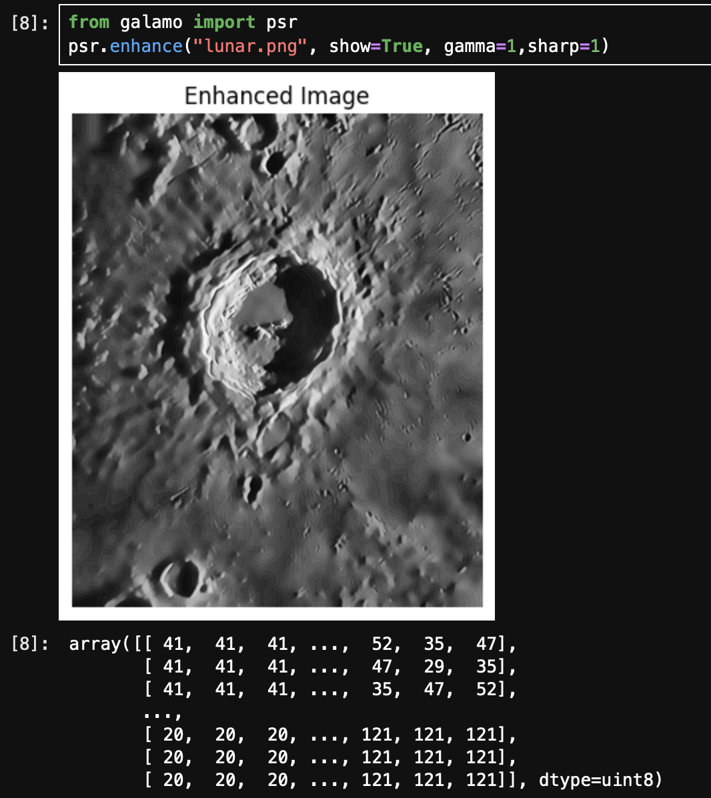

----

[](https://galamo.readthedocs.io/en/latest/)
----

**Galamo** is a Python package designed for astronomical modeling and analysis, offering tools for AGN research, galaxy classification, and more.

- [Website](https://www.galamo.org)
- [Tutorials](https://www.galamo.org/learn.html)
- [Discussion Forum](https://github.com/orgs/galamo-org/discussions)
- [Mailing List](https://groups.google.com/g/galamo-dev)

## Installation

To install `galamo` from PyPI, use:

```bash
pip install galamo --upgrade
```

For detailed instructions, see the [installation guide](https:/www.galamo.org/).

## How the Modules Work (GLimps)

Below are the brief overviews of the main modules in the `Galamo` project, illustrating their workflows and functionalities:

### 1. Galaxy Prediction Based on Photometer Data  
  
This module processes photometric data to predict galaxy morphologies using advanced machine learning algorithms.

---

### 2. BPT Classification Based on Spectral Data  
  
This module classifies galaxies into Seyfert, LINER, or star-forming using Baldwin-Phillips-Terlevich (BPT) diagnostic diagrams derived from spectral line ratios.

---

### 3. PSR Module for Low-Light Image Enhancement  
  
The PSR module enhances low-light astronomical images to improve feature detection and analysis through state-of-the-art image processing techniques.

---


## Contributing

We welcome contributions from the community! Please follow our [Code of Conduct](https://www.galamo.org/code_of_conduct.html) and check out the [contribution guide](https://www.galamo.org/contribute.html) for more details.

## Acknowledging and Citing
Contact: astrodingra@gmail.com
(maniscript under making)
## Supporting the Project


Galamo needs support. Consider donating to support our mission!

## License

Galamo is licensed under a BSD 3-Clause License - see the [LICENSE](LICENSE) file for details.
